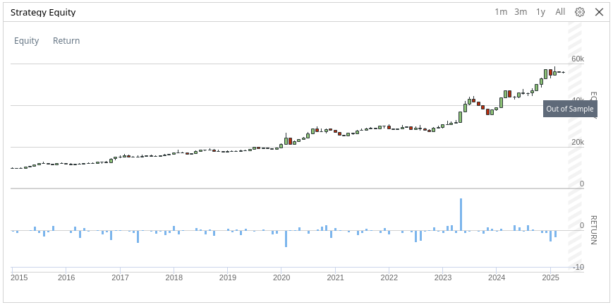

# 🐢 Turtle V2 Trend-Follow Strategy

The strategy is based on the legendary **Turtle Trading** method, which uses **price channel breakouts** (Donchian Channel) to enter and exit positions. This version is adapted for modern markets and allows testing of various index baskets and breakout periods.

**Prerequisites**
* Liquidity
* Volatility
* Trending market

> *Backtest Period: Jan 2015 – Feb 2025*  
> *(Using Top 10 stocks from S&P500 MOMENTUM index)*

### CAGR 
The compound annual growth rate is the rate of return that an investment would need to have every year 
in order to grow from its beginning balance to its ending balance, over a given time interval.

| Stocks    | Benchmark ETF | Momentum ETF | Turtle |
|-----------|---------------|--------------|--------|
| LargeCap  | 16.52%        | 22.23%       | 40.5%  |
| MidCap    | 13.40%        | 17.67%       | 17.8   |
| SmallCap  | 9.91%         | 14.38%       | 15.4   |

### Max drawdown
Maximum drawdown is the worst dip an investment takes from a high to a low. 
Maximum drawdown is an indicator of downside risk over a specified time period 
and highlights the potential volatility of a stock.

| Stocks    | Benchmark ETF | Momentum ETF | Turtle |
|-----------|---------------|--------------|--------|
| LargeCap  | 35%           | 32%          | 36.2%  |
| MidCap    | 44%           | 40%          | 25.9   |
| SmallCap  | 43%           | 45%          | 25.2   |

> * Backtest Period: Jan 2020 – Aug 2025
> * Turtle yearly breakout with filter

---

## ⚙️ Parameters and settings

- **Stock indices**: The strategy works with predefined top 10 stocks from index (e.g. SP500, NASDAQ100, Momentum indices).
- **Breakout periods**: User-selectable lengths for entry and exit signals (e.g. YEARLY = 250-day entry, 125-day exit).
- **Benchmark filter**: Optional filter that allows purchases only when the benchmark (e.g. SPMO) is above its 200-day SMA.
- **Leverage**: Allows you to set the leverage for positions.

---

## 📈 Indicators

- **Donchian Channel (DCH)**: For each symbol, the upper and lower bands are calculated based on the selected breakout period.
- **SMA200**: Used for the benchmark filter, if activated.

---

## 🧠 Strategy Logic

### 1. **Entry Condition (Buy Condition)**:
- The closing price is **above the upper band** of the Donchian Channel.
- The benchmark is **above the 200-day SMA** (if the filter is active).
- The position is no longer open (not long).

### 2. **Exit Condition (Sell Condition)**:
- The closing price is **below the lower band** of the Donchian Channel.
- The benchmark is still above the SMA200 (if the filter is active).

---

## 💼 Position Management

- **Entry**: If conditions are met, the position is set using `set_holdings` evenly across all stocks in the basket, taking into account the leverage effect.
- **Exit**: If exit conditions are met, the position is **completely closed** using `liquidate`.

---

## 🧪 Backtesting Settings

- **Start date**: 5 years back from the current year.
- **Initial capital**: $10,000.
- **Daily data**: Daily resolution is used for all stocks.

---

## 🧭 Summary

Turtle V2 is a systematic trend-following strategy that:
- Tracks breakouts of historical highs/lows.
- Uses a filter based on market strength (benchmark SMA).
- It is flexible thanks to the ability to choose an index, breakout period and leverage.
- It is suitable for backtesting and analyzing the performance of various momentum baskets.

---

## Resources
* [Kryptoměny – Jak je obchodovat systematicky a vydělávat na růstu i propadu?](https://www.financnik.cz/clanky/obchodni-strategie/kryptomeny-systematicky/#trendove-obchodovani-kryptomen)
* [Jak na Trend Following (trendové obchodování)](https://www.financnik.cz/clanky/obchodni-strategie/trend-following/)
* [Turtle Trading Tutorial](https://www.asktraders.com/learn-to-trade/trading-strategies/turtle-trading-tutorial/)
* [Turtle Trading: History, Strategy & Complete Rules - Analyzing Alpha](https://analyzingalpha.com/turtle-trading)
* [Turtle Trading: A Market Legend](https://www.investopedia.com/articles/trading/08/turtle-trading.asp)
* [TURTLE TRADING - STRATEGY EXPLAINED](https://www.tradingview.com/chart/EURUSD/72x1YqG6-TURTLE-TRADING-STRATEGY-EXPLAINED/)
* [Donchian Channels Formula, Calculations, and Uses](https://www.investopedia.com/terms/d/donchianchannels.asp)
* [Legendy tradingu (3. díl): Experimentátor, který změnil pohled na obchodování](https://www.purple-trading.com/cs/legendy-tradingu-richard-dennis/)
* [Turtles Trading Strategy Explained - COMPREHENSIVE](https://www.youtube.com/watch?v=eotKvzrJVQk)
* [TURTLE TRADERS STRATEGY - The Complete TurtleTrader by Michael Covel. (Richard Dennis)](https://www.youtube.com/watch?v=NJkXSZUHl1g)